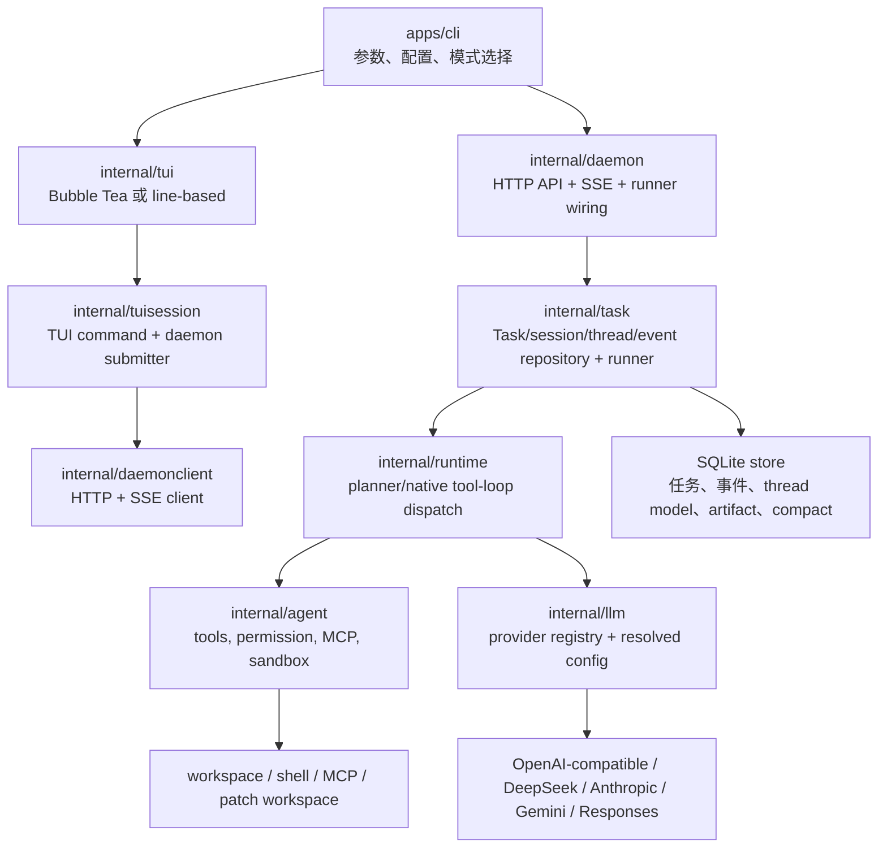

# Liora 架构对标报告

日期：2026-07-03

范围：梳理 `/Users/bytedance/dev/liora` 当前架构，并对标本地 Claude Code source snapshot、Kimi Code 本地仓库，以及 OpenCode 的多 provider/model 设计。本文区分“当前源码事实”“参考项目做法”和“建议路线图”，避免把已有能力当成重写目标。

## 1. 结论

Liora 当前不是空白原型：Go core、embedded/external daemon、SQLite task/event/session/thread store、Bubble Tea TUI、daemon SSE、per-thread model binding、provider registry、native tool loop 和 planner fallback 都已经成形。真正的差距集中在四个方向：

1. Provider/model UX 还不够“可发现”：已有 per-thread routing，但缺少类似 OpenCode 的 profile/catalog/model picker、credential 与 policy 分层、能力元数据刷新。
2. Tool loop 还不够“边流边做”：Liora 已有结构化 tool loop 和只读工具并发，但仍主要等完整 model turn 返回后再执行；Claude Code 的参考实现会在 streaming `tool_use` block 到达时启动 concurrency-safe tool executor。
3. TUI 已经从 line-based smoke 走向全屏产品，但 release gate 还需要真实滚动、render budget、长输出分页、approval/todo/subagent/schedule 面板和 provider/model/latency/retry 可视化。
4. Kimi Code 的强项不是某个 UI 控件，而是 SDK/server/agent-core 边界更正式，loop、tool scheduler、plugin/provider/profile 都有稳定 host API；Liora 后续应把现有 Go daemon/protocol 固化成类似“一个 core，多入口”的契约。

优先级建议：不要重写核心架构。本轮已经在现有 `internal/llm` registry、thread model API 和 `/model` 命令上补了一个 provider profile catalog 窄切片；后续继续把 doctor/config、task metadata、streaming tool executor、TUI render/perf gate 和 Kimi-style resource-aware tool scheduler 做实。

## 2. 证据边界

本报告使用的主要证据：

- Liora 当前源码和文档：`internal/llm/*`、`internal/runtime/runtime.go`、`internal/agent/loop.go`、`internal/tuisession/daemon_submitter.go`、`internal/daemon/*`、`docs/coding-agent-architecture-plan.md`、`docs/liora-1.0-plan.md`、`implementation-notes.md`。
- Claude Code：`/Users/bytedance/claude-code-main` 是 source-map snapshot，不是官方 Anthropic git 仓库。该目录 README 明确说明它是研究用公开 snapshot，并非官方 repo；因此本文只把它作为架构参考，不把版本、产品声明或 commit metadata 当作官方事实。
- Kimi Code：`/Users/bytedance/dev/kimi code/kimi-code` 本地仓库，重点读 repo guide、CLI entry、agent-core loop 和 tool scheduler。
- OpenCode：使用当前官方文档作为 provider/model 对标来源：[Providers](https://opencode.ai/docs/providers/)、[Models](https://opencode.ai/docs/models/)、[Config](https://opencode.ai/docs/config/)。

## 3. 当前 Liora 架构

### 3.1 分层现状

Liora 的文档分层已经比较清晰：前端入口层只负责渲染与输入，协议层负责 contract/client/SSE/reducer，Go core 后端负责任务编排、工具执行、持久化、沙箱和权限。当前 `docs/coding-agent-architecture-plan.md:84` 到 `docs/coding-agent-architecture-plan.md:96` 已经列出 daemon、task、runtime、agent、llm、mcp、store、permission、capabilities、trace 的职责，`docs/coding-agent-architecture-plan.md:100` 到 `docs/coding-agent-architecture-plan.md:112` 明确了依赖方向和“模型路由显式化”。

从源码看，当前结构与这份架构基本一致：

- `apps/cli` 装配配置、doctor、daemon/TUI 模式；交互入口在 TTY 下走 Bubble Tea，全屏 TUI 与 line renderer 共存，见 `docs/coding-agent-architecture-plan.md:165` 到 `docs/coding-agent-architecture-plan.md:179`。
- `internal/tuisession` 复用 daemonclient，把 `/help`、`/model`、`/thread`、`/timeline`、`/watch` 等命令接到 daemon API/SSE。
- `internal/task` 是任务、session、thread、event、artifact、compact 和 prompt-context 的持久事实来源。
- `internal/runtime` 在每轮提交时选择 native structured tool loop 或 planner fallback；`internal/runtime/runtime.go:91` 到 `internal/runtime/runtime.go:158` 是主分支，`internal/runtime/runtime.go:160` 到 `internal/runtime/runtime.go:178` 做 provider tool support gate。
- `internal/llm` 已经不是单例 client，而是 registry + per-request resolved config：`internal/llm/registry.go:27` 到 `internal/llm/registry.go:72` 会合并默认配置、请求配置、trace labels 和 metrics，再调用 `ResolveConfig`。

### 3.2 Tool loop 能力

当前 Liora 已有可用的 native tool loop。`internal/agent/loop.go:19` 到 `internal/agent/loop.go:23` 写明 observe-act-observe 的设计：模型输出 tool call，agent 执行后把 tool result 作为 message 回灌。关键保护包括：

- 最大 turn bound：`internal/agent/loop.go:14` 到 `internal/agent/loop.go:17` 默认最多 25 turn，只读工具并发上限 10。
- repeated failure short-circuit：`internal/agent/loop.go:124` 到 `internal/agent/loop.go:165` 记录失败 signature，重复失败直接结束。
- permission fail-closed：`internal/agent/loop.go:183` 到 `internal/agent/loop.go:205` 在任何工具执行前检查本轮所有 tool call。
- 并发策略：`internal/agent/loop.go:207` 到 `internal/agent/loop.go:245` 只让连续 read-only tool batch 并发，write/shell/external 类工具串行。
- provider gate：`internal/llm/tools.go:47` 到 `internal/llm/tools.go:63` 对 OpenAI Chat/OpenAI-compatible、DeepSeek、Anthropic 走 native tool call；Gemini 和 OpenAI Responses 返回 `ErrToolsUnsupported`，由 runtime fallback 到 planner 路径。

这已经是对标 Claude/Kimi 的正确地基，但还不是完全对齐。主要差距是：Liora 在 model 完整返回 `ToolCalls` 后才执行；Claude Code source snapshot 里 `src/query.ts` 引入 `StreamingToolExecutor`，并在 streaming 期间处理 `tool_use` block 和 tombstone/orphaned message；Kimi 则把 tool batch lifecycle 和 scheduler 明确拆开。

### 3.3 Provider/model routing

当前 Liora 支持这些 provider 常量：`openai-chat`、`openai-responses`、`deepseek`、`anthropic`、`gemini`，见 `internal/llm/client.go:11` 到 `internal/llm/client.go:17`。`Config` 里已经有 provider、base URL、API key、model、profile、capability、timeout、retry policy、token budget、trace labels 和 metrics，见 `internal/llm/client.go:30` 到 `internal/llm/client.go:46`。

能力推断现在是 heuristic：`internal/llm/capability.go:5` 到 `internal/llm/capability.go:35` 根据 provider/model 字符串设置 native tool use、streaming、vision、long context、JSON schema 和 max output tokens。这个能力面足够支持 doctor/config 和 runtime gate，但还不是 source-backed model metadata catalog。

TUI 侧 `/model` 已经能看和改当前 thread 的 model binding：`internal/tuisession/model_command.go:12` 到 `internal/tuisession/model_command.go:44` 展示当前 thread model 和可用 profile 提示；`internal/tuisession/model_command.go:46` 到 `internal/tuisession/model_command.go:138` 支持 `/model profiles`、`/model set <profile>` 和 `/model set <provider> <model> [profile]`。当前已补上的缺口是最小结构化 catalog discovery/selection；后续缺口是 richer model picker、capability metadata 和 policy。

### 3.4 Context、artifact、compact

Liora 的上下文治理已经有比普通 demo 更深的 substrate：

- `implementation-notes.md:34` 到 `implementation-notes.md:39` 说明 `prompt_context.snapshot` 会记录真实 natural task prompt 使用过的 context 摘要和 hash，不保存全文，避免诊断面外泄敏感内容。
- `docs/liora-1.0-plan.md:241` 到 `docs/liora-1.0-plan.md:244` 把 context budget、manual compact、compact boundary、context packer 写成 1.0 主线。
- `internal/task/store.go` 已经包含 context packer、artifact preview、compact boundary 和 diagnostics 相关实现；大输出可以通过 artifact 引用避免污染模型上下文。
- `docs/release.md:70` 已列出 release smoke 和 Go tests 覆盖 `/artifact` 长输出分页、multi-task SSE、`/watch`、`/timeline`、`/cancel`、`/todo` 等面。

这意味着下一步应把 context/perf 指标做成 release gate，而不是重新设计上下文体系。

## 4. 对标 Claude Code

### 4.1 值得借鉴的点

Claude Code snapshot 的 README 声明它是 TypeScript/Bun、React + Ink terminal UI、约 1900 个文件的 source snapshot，并非官方 repo，见 `/Users/bytedance/claude-code-main/README.md:1` 到 `/Users/bytedance/claude-code-main/README.md:49`。

对 Liora 最有价值的参考点：

1. Streaming tool executor：`/Users/bytedance/claude-code-main/src/query.ts` 引入 `StreamingToolExecutor`，并在多处围绕 `tool_use`、tombstone、orphaned messages 和 retry 重建 executor。核心启发是把“模型还在流式输出”和“安全工具已可执行”重叠起来，降低长任务感知延迟。
2. Prefetch：同一主循环会把 relevant memory 和 skill discovery 做成 turn/iteration 级预取，避免所有上下文检索都卡在首 token 前。Liora 目前有 prompt-context snapshot/context packer，但还缺少同等级的 prefetch profiling 和命中指标。
3. Stateful REPL shell：Claude 的 REPL 层非常重，负责 dialog、queue、spinner/footer、virtualized rendering 和 tombstone 后 transcript 清理。Liora 的 Bubble Tea TUI 已经成形，但还需要把 approval/todo/model/provider/status/panel 和 render budget 打成稳定产品面。
4. Product-specific provider routing：Claude snapshot 暴露的 API provider 是 `firstParty|bedrock|vertex|foundry`，SDK schema 中也有 agent model `inherit` 和 `api_retry` event。它成熟的是路由、fallback、继承和 retry 语义，不是 OpenCode 那种广义多供应商 catalog。

### 4.2 Liora 与 Claude 的关键差距

| 维度 | Liora 当前 | Claude 参考 | 建议 |
| --- | --- | --- | --- |
| Tool execution | 完整 model turn 返回后执行 tool calls；只读 batch 并发 | streaming 期间可启动安全 tool use，并处理 tombstone/orphan | 先做 streaming tool-use parser + executor MVP，仅对 read-only/validated tools 开启 |
| Context latency | 有 context packer/snapshot，但主要是执行前同步准备 | turn/iteration 级 memory/skill prefetch | 增加 prefetch 阶段事件、耗时指标、命中率 |
| TUI | Bubble Tea 全屏已成形，line smoke 仍重要 | REPL 状态机更成熟，footer/dialog/virtualization 深 | 给 TUI 加 render frame/backlog budget 和 200+ 行 scrollback gate |
| Provider | 多 provider registry，通用化潜力更大 | Anthropic 产品线 provider routing 更成熟 | 借鉴 retry/fallback/inherit 语义，不照搬 provider 集合 |

## 5. 对标 Kimi Code

Kimi Code 本地仓库的根 `AGENTS.md` 明确了边界：`apps/kimi-code` 是 CLI/TUI，消费 `@moonshot-ai/kimi-code-sdk`，不能直接依赖 `@moonshot-ai/agent-core`；`packages/agent-core` 拥有 Agent、Session、profile、skills、tools、plan、permission、background、records 和 service layer；`packages/server` 把 agent-core session 通过 REST/WebSocket 暴露出去，见 `/Users/bytedance/dev/kimi code/kimi-code/AGENTS.md:17` 到 `/Users/bytedance/dev/kimi code/kimi-code/AGENTS.md:27`。

### 5.1 值得借鉴的点

1. 正式 SDK/server/core 边界：Kimi CLI entry 只解析参数、做 update preflight，然后进入 print 或 shell runner，见 `/Users/bytedance/dev/kimi code/kimi-code/apps/kimi-code/src/main.ts:41` 到 `/Users/bytedance/dev/kimi code/kimi-code/apps/kimi-code/src/main.ts:67`。这让 TUI、Web、server、ACP adapter 可以驱动同一 agent core。
2. Loop 是 host-independent：`packages/agent-core/src/loop/README.md:3` 到 `:23` 说明 loop 不拥有 session、transport、permissions UI 或 durable protocol bridging，只负责 turn convergence、provider step、tool batch lifecycle、scheduler、event/model surface。
3. Resource-aware tool scheduler：`tool-scheduler.ts:1` 到 `:10` 说明 scheduler 只管执行顺序，非冲突 resource access 可重叠，冲突任务按 provider order 边界串行；`tool-access.ts:67` 到 `:108` 用 read/search/write/readwrite 判断冲突。
4. Provider/plugin surface 更正式：Kimi 有 provider adapter boundary、profile/catalog/import 入口、plugin marketplace、install/toggle/update badge、MCP enablement 等 UI 与 core 结合点。

### 5.2 Liora 与 Kimi 的关键差距

| 维度 | Liora 当前 | Kimi 参考 | 建议 |
| --- | --- | --- | --- |
| Client/core boundary | Go daemonclient + packages/protocol 已有雏形，但 Go core/TUI 同仓强绑定更多 | CLI/Web/Server 都经 SDK/REST/WebSocket 驱动 agent core | 把 daemon API + packages/protocol 固化为 public contract，不让 UI 依赖内部 model |
| Tool scheduler | read-only 连续 batch 并发，写类串行 | Resource access 冲突图，结果保持 provider order | 在 Liora tool schema 上增加 access descriptor，逐步替换只读/非只读二分 |
| Plugin/provider | MCP/skills 已有，provider registry 轻量 | plugin manager 把 plugin 物化为 skills、hooks、MCP，TUI 有 marketplace | 先做 provider profile catalog，再扩到 plugin/profile UI |
| TUI architecture | Bubble Tea + command handler + daemon stream | TUI 有 session event controller、stream flush、reverse RPC、background task、autocomplete | 拆 TUI 面板与 event reducer，避免所有状态挤在 transcript formatter |

## 6. Provider 与 OpenCode 对标

OpenCode 是 provider/model catalog 的主要参考。官方 docs 说明它使用 AI SDK 和 Models.dev 支持 75+ providers 和 local models，并通过 `/connect` 添加 credential，通过 config 的 `provider` section 自定义 provider/base URL。见 [OpenCode Providers](https://opencode.ai/docs/providers/)。Models docs 采用 `provider/model` 格式，支持 variants，并按 `--model`、config、last used、internal priority 的顺序加载模型，见 [OpenCode Models](https://opencode.ai/docs/models/)。Config docs 还把 `disabled_providers` 和 `enabled_providers` 作为独立 policy，且 disabled 优先，见 [OpenCode Config](https://opencode.ai/docs/config/)。

Liora 应借鉴的是这些结构，而不是立即追求 provider 数量：

1. Provider profile catalog：把 `cheap`、`strong`、`local`、`review` 这类 profile 做成可列出、可选择、可诊断的对象。
2. `provider/model` identity：内部仍可保留 provider/model/profile 字段，但 UI 和 config 应支持稳定 ID，便于 `/models`、doctor、history 和 task metadata 对齐。
3. Credential 与 config 分层：OpenCode 的 `/connect` credential 与 provider config 分开；Liora 当前也应避免把 API key 持久化进 thread model binding。catalog 选择只持久 provider/model/base_url/profile，API key 保持 env/config secret-only，输出始终 redacted。
4. Capability metadata：当前 `ProviderCapability` 是 heuristic；下一步要引入 source-backed model metadata 或可刷新 catalog，让 native tools、streaming、vision、long context、JSON schema、max output tokens 不靠字符串猜测。
5. Provider policy：引入 allow/deny 或 workspace policy，避免“有环境变量就自动可用”的隐式行为。

本轮已落地一个窄切片：`LIORA_LLM_PROFILES` 作为 JSON catalog，`/model profiles` 列表展示 redacted details，`/model set <profile>` 在 profile 命中 catalog 时应用 provider/model/base URL/profile；未命中时保留现有“仅切当前 thread profile”的行为。解析边界在 `internal/llm/provider_profile.go:38` 到 `internal/llm/provider_profile.go:82`，运行时 secret 解析在 `internal/llm/registry.go:32` 到 `internal/llm/registry.go:115`，TUI command 面在 `internal/tuisession/model_command.go:58` 到 `internal/tuisession/model_command.go:156`。测试覆盖 catalog parse、redaction、catalog selection、旧 profile-only 行为和显式 provider/model 行为，见 `internal/llm/provider_profile_test.go`、`internal/llm/registry_test.go`、`internal/tuisession/model_command_test.go` 和 `internal/tuisession/daemon_submitter_test.go:1776` 到 `internal/tuisession/daemon_submitter_test.go:1842`。

## 7. 性能问题与风险

### 7.1 LLM streaming 覆盖不均

`implementation-notes.md:3` 到 `implementation-notes.md:7` 记录了本轮 SSE 流式先收敛到 OpenAI Chat/DeepSeek 兼容接口，Anthropic/Gemini 暂保持原实现。源码上也能看到 `GenerateWithToolsStream` 只有 OpenAI Chat/DeepSeek 走真正 streaming；其它 provider fallback 到完整内容后一次性调用 delta handler，见 `internal/llm/tools.go:66` 到 `internal/llm/tools.go:87`。

风险：用户在某些 provider 下仍会觉得“卡住”，即使 TUI 支持 `assistant.delta`。

建议：doctor/config 和 timeline 显示 provider 的 streaming/native-tool support；TUI 在非 streaming provider 上明确显示“waiting provider response”，不要伪装成 token streaming。

### 7.2 Patch workspace copy latency

`implementation-notes.md:14` 记录了 patch-first 默认下 workspace copy 可能变慢，本轮已增加 context cancel、跳过重型依赖/构建缓存目录，并在复制前写 `sandbox.workspace` preparing 事件。

风险：大 monorepo 中首事件延迟仍可能主要花在 copy，而不是 LLM。

建议：把 patch workspace copy latency 纳入 task event 和 performance smoke；对 `.git`、`node_modules`、build cache、large artifact 做更严格预算和统计。

### 7.3 TUI render/backlog 风险

当前 daemon SSE 已经比较完整，多任务 stream 也有公平性测试。但 A 线程发现单 task stream 会 drain post-cursor events，TUI 端在 streamed delta 时仍可能重建较大的 transcript body。`docs/liora-1.0-plan.md:167` 到 `docs/liora-1.0-plan.md:180` 已把 scrollback、resize、大 diff、大输出、render backlog、provider latency 写成 1.0 验收。

建议：给 Bubble Tea full-screen TUI 增加 frame cost/backlog 观测；200+ 行 transcript + streaming + PgUp/滚轮必须进 release gate。

### 7.4 Tool loop latency

Liora 的 native tool loop 已经能工作，但执行窗口还在完整 model turn 之后。Claude 的 streaming executor 说明可以在 `tool_use` block 到达后提前跑安全工具，这会显著改善“模型输出很长，然后才开始跑工具”的体感。

建议：先实现只读工具的 streaming executor MVP，并保留 tombstone/orphan guard：如果 partial/orphaned tool use 失效，不能污染 transcript 或重复执行旧 tool result。

### 7.5 Capability/catalog 陈旧

`ProviderCapability` 当前是静态 heuristic。随着 provider/model 快速变化，native tool、JSON schema、vision、context window、reasoning variants 很容易失真。

建议：短期把 catalog/env profile 与 capability test 固化；中期引入 Models.dev 或内部可刷新 catalog；长期记录 live validation result 和 fallback parity tests。

## 8. 使用体验与 TUI

Liora 的 TUI 方向是对的：Go 原生 Bubble Tea、line renderer 作 smoke/fallback、daemon SSE 作为统一事件源。当前已经覆盖 command palette、assistant delta aggregation、Markdown 渲染、`/doctor`、`/config`、`/watch`、`/artifact`、`/todo` 等基础面。

下一阶段体验重点：

1. `/model` 从“知道命令的人能用”升级到“新用户能发现”：`/model` 展示可用 profiles；`/model profiles` 展示 provider/model/capability/base URL/key redaction；后续补 `/models` picker。
2. 状态栏分清阶段：copy workspace、waiting provider、streaming assistant、running tools、waiting approval、queued、cancelled、failed、completed。
3. transcript 不是无限文本框：历史滚动、follow latest、large diff/artifact preview、tool output paging 要有固定布局，不让长输出拖垮输入。
4. provider/model visible：每个 task、thread、tool trace、timeline 都能看见实际 provider/model/profile，慢 provider 能直接定位。
5. line-based 只做 fallback/smoke，主体验验收必须用真实 TTY 或 PTY 自动化覆盖。

## 9. 写代码能力

当前 Liora coding ability 的底座：

- 工具执行：`internal/agent` 已经有 read/search/shell/patch/MCP/todo/task 等工具调度。
- 安全：permission checker 在 tool loop 执行前 fail-closed，patch workspace 避免直接写主 workspace。
- Resume/context：task/session/event/transcript/artifact/context snapshot 都在向长期会话靠拢。
- Provider routing：thread model binding 和 task metadata 能记录实际 provider/model/profile。

缺口：

1. Streaming tool execution：缩短从 model 产出 tool intent 到工具开始执行的延迟。
2. Resource-aware scheduler：借鉴 Kimi 的 ToolAccesses，而不是只按 read-only/non-read-only 分类。
3. Deterministic eval：native tool loop 与 planner fallback 要有同一任务的 parity eval，避免不同 provider 能力差导致行为漂移。
4. Context packer quality：不仅要预算，还要任务相关性、compact continuation 和 prompt injection boundary 的负例。
5. Background/subagent：Liora 计划里已有 parent task 创建 child task 的方向，后续要把 child output、权限继承、model binding 继承和 artifact 读取闭环。

## 10. 建议路线图

### P0：把已有 provider routing 变成可用产品面

本轮已完成：

- 落地 `LIORA_LLM_PROFILES` catalog。
- `/model` 显示 profiles hint；`/model profiles` 列出 redacted details；`/model set <profile>` 支持 catalog 命中。
- API key 不写入 thread binding；runtime resolve 时使用 matching catalog secret。
- 测试覆盖：catalog parse、`/model profiles`、`/model set cheap`、旧 profile-only 行为、explicit provider/model 行为、secret redaction。

仍需补齐：

- doctor/config 显示 default、thread override、profile catalog、capability、redacted credential。
- `/models` 或 picker 面显示 provider/model/profile/capability/source。
- provider allow/deny policy 和 QoS/fallback 状态进入 timeline/doctor。

### P0：TUI/perf release gate

- 记录 first event latency、provider latency、retry count、render backlog、event backlog。
- 真实 TTY/PTY smoke：200+ 行 transcript、streaming 中滚动、长 artifact、run 中 `/cancel`。
- 非 streaming provider 显示明确等待状态。

### P1：Claude-style streaming tool executor

- 从 OpenAI-compatible/DeepSeek streaming tool calls 开始。
- 只对已验证 read-only/安全 tool 提前执行。
- transcript 必须有 tool_use/tool_result pairing guard、orphan/tombstone/retry 去重。
- 失败时自动退回现有完整-turn tool loop。

### P1：Kimi-style tool access scheduler

- 给 Liora tool schema 增加 access descriptor：file read/search/write/readwrite、shell/external/all。
- Scheduler 按 resource conflict 并发，结果保持 provider order。
- 权限与 hook 仍在执行前 fail-closed。

### P1：Provider metadata catalog

- 先做本地静态 catalog + tests，再接入 Models.dev 或内部 catalog。
- capability 从 heuristic 升级为 catalog-backed + live validation cache。
- 支持 variants：fast/cheap/strong/review/high-thinking 等。
- 引入 provider allow/deny policy。

### P2：Core/API/SDK 边界硬化

- 把 `packages/protocol`、Go daemonclient、SSE fixtures 作为 public contract。
- TUI/Web/CLI 都只消费 contract，不读 core 内部 store/model。
- plugin/profile/MCP/status 面统一经过 daemon capability API。

## 11. 下一步验收矩阵

| 能力 | 验收证据 |
| --- | --- |
| Provider profile catalog | `go test ./internal/llm ./internal/tuisession ./apps/cli`；`/model profiles` redaction；thread binding 不持久化 API key |
| Native/fallback parity | 同一 deterministic coding task 在 native tool loop 和 planner fallback 都完成，trace 中可见 provider/model/profile |
| Streaming TUI | 真实 PTY 下 assistant delta 可见，200+ 行 scrollback 不冻结，运行中 `/cancel` 生效 |
| Tool scheduler | 两个不冲突 read/search 并发，冲突 write 串行，结果顺序与 provider order 一致 |
| Provider isolation | 一个 provider 429/5xx 不阻塞 sibling thread，metrics 按 provider/model/profile 分桶 |
| Context governance | `prompt_context.snapshot`、compact boundary、artifact preview、untrusted diagnostics 都进入 eval |
